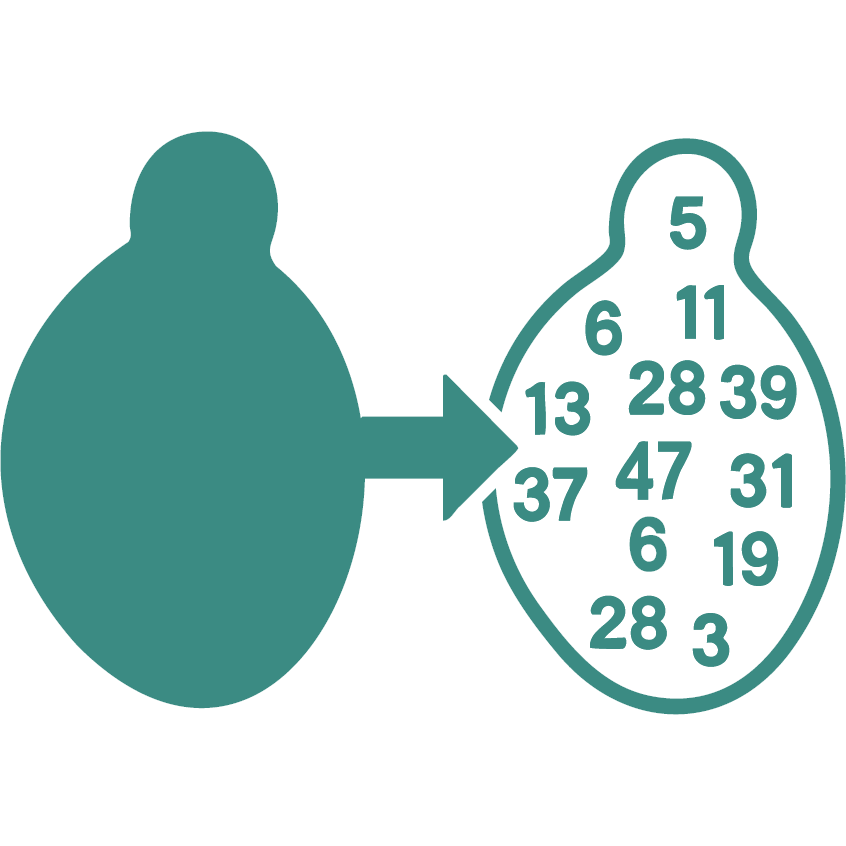

# YeastSAM

<div align="center">
  
</div>

YeastSAM is a framework for yeast cell analysis and mask processing. It provides an intuitive GUI launcher and various tools for generating masks, image registration, and outline conversion. For detailed documentation, visit [YeastSAM](https://yeastsamdoc.readthedocs.io/en/latest/).

## Installation

### Prerequisites

Create and activate a conda environment with micro-sam:

```bash
conda create -c conda-forge -n micro-sam micro_sam
conda activate micro-sam
```

## Usage

### Launch the GUI

To start the YeastSAM tools launcher:

```bash
python launch.py
```

This will open a GUI with four main sections:

### 1. Generate Masks
- **napari**: Opens napari viewer for interactive mask generation and editing. You can load our custom weight YeastSAM for better accuracy in budding yeast. 

### 2. Optional Tools
This section is to fix the offset between smFISH image and DIC (as masks are generated from DIC).
- **Shift Analyzer**: Analyze and detect shifts in your image data
- **Apply Registration**: Apply image registration corrections

### 3. Convert to Outline File
- **Mask2Outline**: Convert mask files to FISH-Quant compatible outline format

### 4. Separation Module
- **Mask Editor**: You can annotate mask images manually or with CNN & U-Net separation module. Download models at ''

## Tools Overview

The `tools/` directory contains the following utilities:

- `shift.py`: Shift detection and analysis
- `registration.py`: Image registration functionality
- `Mask2Outline.py`: Mask to outline conversion
- `mask_editor.py`: Advanced mask editing interface

## Acknowledgement

We acknowledge the following reference for inspiring our work:

Archit, A., Freckmann, L., Nair, S. et al. *Segment Anything for Microscopy*. Nat Methods 22, 579–591 (2025). https://doi.org/10.1038/s41592-024-02580-4

See the full [COPYRIGHT](src/COPYRIGHT) notice for details.
